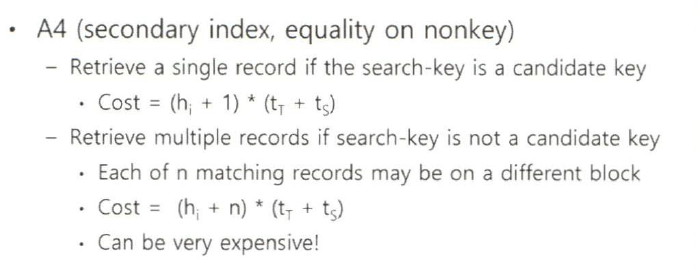

# 데이터베이스 응용
## 트랜잭션 이론
### 트랜잭션 개념
- 트랜잭션은 하나의 논리적 작업을 수행하는 데이터베이스 연산의 순서임
  - 즉, 연산의 논리적 단위이며 데이터를 접근하고 갱신하는 DB 프로그램의 논리적 수행 단위임
  - ex) start transaction ~ commit
- 트랜잭션 관리
  - 다양한 시스템 장애를 극복하는 **회복 기능**
  - 다수개의 트랜잭션을 동시에 수행하였을 대 발생하는 문제점을 해결하는 **동시성 제어 기능**
- ACID
  - 원자성(atomicity)
    - all-or-nothing
    - 연산 모두가 수행되거나 어느 연산도 수행되지 않아야 함
  - 일치성(consistency)
    - 단일 트랜잭션의 수행은 데이터 무결성을 유지함
    - 트랜잭션 시작 시 무결성 제약 만족 -> 종료 시에도 무결성제약을 만족 시켜야함
    - 다만, 트랜잭션 수행 중간에는 무결성제약을 만족하지 않을 수 있음
  - 고립성(isolation)
    - 다수 개의 트랜잭션이 동시 수행되어도 사용자에게는 본인 트랜잭션만이 홀로 수행되고 있는 느낌을 줌
  - 지속성(durability)
    - 완료된 트랜잭션의 결과는 후에 시스템 장애가 발생하여도 데이터베이스 상태에 반영되어야 함
- 
  - 3번 라인을 수행하고 6번 라인 수행 전에 시스템 장애 발생 시 
    - 3번 라인 효과를 DB 시스템에서 제거해야함
    - 원자성에 의해!
  - 3번과 6번을 수행하고 commit까지 진행 후 DB 시스템 장애 발생 시
    - 지속성에 의해, 위 수행 라인은 데이터베이스 상태에 반영되어 있어야 함
- 
  - 이와 같은 예제는 고립성 요구사항에 위배됨
  - T2가 접근하는 데이터 A,B는 T1의 트랜잭션 중간값이기 때문
    - 실행 중간 값은 무결성 제약을 만족하지 않을 수 있고, 실제로 상기 예제는 무결성 제약을 위배하고 있음
  - 트랜잭션을 직렬실행 하면 고립성은 자연스럽게 제공되나, 현실적으로 불가능
- 트랜잭션 상태
  - 
  - 수행(Active) -> 부분 완료(partially committed) -> 조치(ex 로그 기록) -> 완료(Committed)
  - 수행 중인 상태에서 트랜잭션의 모든 문장이 실행되면 부분 완료 상태가 됨
  - 트랜잭션 완료를 위한 조치(ex 로그에 기록) 가 성공적으로 수행되면 트랜잭션은 완료 상태가 됨
  - 만약 여러한 경우로 완료 전 트랜잭션 연산을 수행하지 못하는 상황이 발생한다면, 트랜잭션이 철회(aborted)상태가 됨
    - 이 경우, 트랜잭션 초기에 시작할 상태로 DB를 원상 복귀 시켜야 함
- 동시 실행
  - 시스템은 여러 개의 트랜잭션을 동시에 수행함
    - 자원 활용성 증가 및 평균 응답 시간 감소
    - 마치 운영체제에서 개별 프로세스의 동시성 수행!
  - 다만, 동시성 제어를 해줘야 함

### 직렬가능
- 올바른 실행
  - 다수 개의 트랜잭션을 동시 수행 시, 올바른 트랜잭션 실행의 정확한 정의는 무엇인가?
  - 트랜잭션을 순차적으로 수행하는 *직렬수행* 방법은 항상 올바르다
  - 다만 현실적으로 운영 불가능
- 틀린 실행 현상
  - 오손읽기(dirty read)
    - 
    - 완료되지 않은 값(uncommitted value, dirty value)을 읽는 연산을 뜻함
    - T1이 철회를 하면 T2 또한 철회해야함
  - 갱신 손실(lost update)
    - 
  - 반복불가 읽기(unrepetable read)