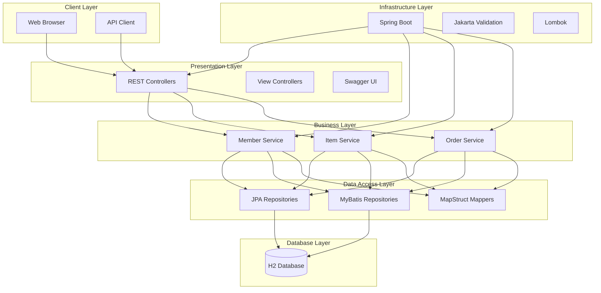
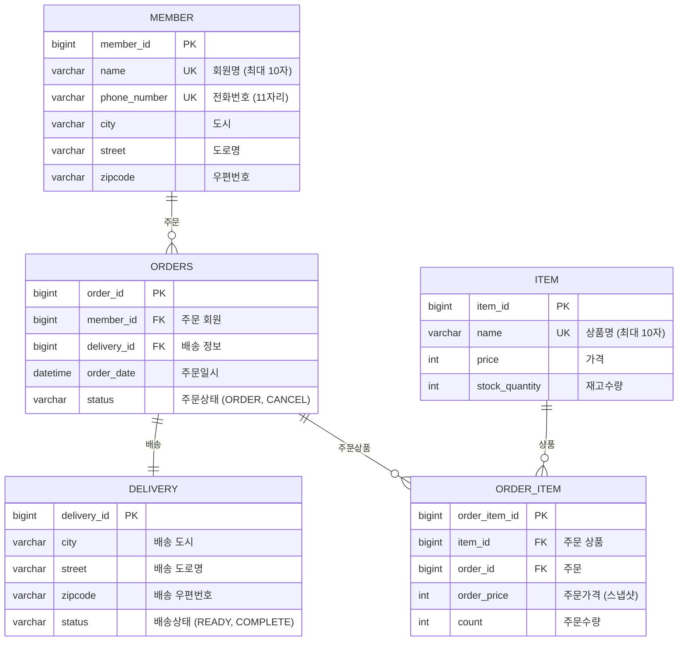
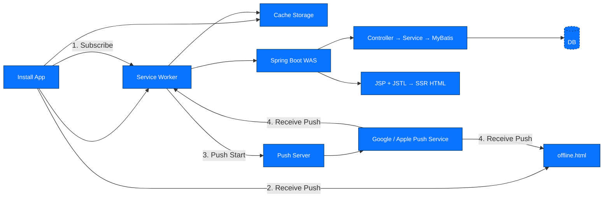
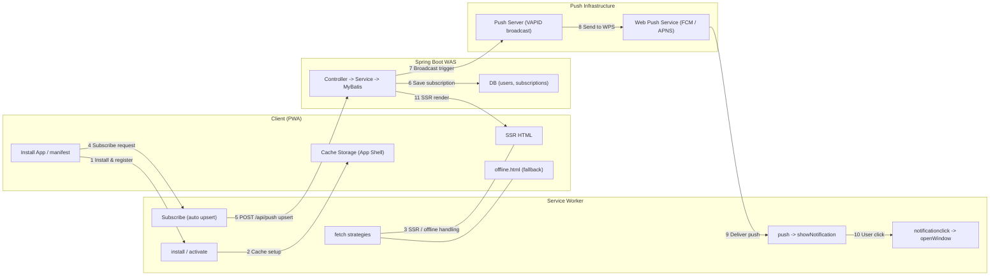

# 📊 LLM 부하 테스트 플랫폼 - 자원 및 소요 기간 상세 계획 (1년 기준)

---

## ✅ 1. 비용 자원 (인건비 제외)

| 항목 | 필요 자원 및 내용 | 비고 |
|------|------------------|------|
| **서버/DB 인프라** | - AWS EC2 또는 Render<br>- RDS<br>- 월 10~30만 원 수준 | 초기 MVP는 프리티어로 커버 가능 |
| **GPT API 사용료** | - OpenAI, Claude API 테스트<br>- 월 $50~100 수준 (단일 모델) | 모델 수 늘어날수록 증가 |
| **도메인/SSL 인증** | - 도메인 연 2만 원<br>- SSL 무료(Let's Encrypt) 또는 유료(기업용) | SaaS 제품 필수 |
| **기타 운영 도구** | - PDF 리포트 도구<br>- CI/CD, 모니터링 등 SaaS 연동 | 선택적 과금 예상 |
| **총비용 추정** | 약 **300~500만 원/연** | 인건비 제외 기준 |

---

## ✅ 2. 기술 자원 (Java 백엔드 중심)

| 항목 | 기술 스택 | 비고 |
|------|------------|------|
| **백엔드** | - Java 17+, Spring Boot 3<br>- WebClient / OkHttp<br>- Spring Security (JWT 인증) | API 서버 및 LLM 연동 |
| **프론트엔드** | - React<br>- Chart.js, Recharts 등 시각화 | 결과 대시보드 및 입력 화면 |
| **데이터베이스** | - RDBMS 또는 NoSQL<br>- Redis (선택) | 응답 캐싱, 중복 방지 |
| **부하 테스트 엔진** | - Apache JMeter (CLI 기반)<br>- Gatling (Java 기반 DSL)<br>- 직접 구현 시 Executor 기반 비동기 처리 | 스트리밍 응답까지 커버 가능 |
| **기타 기능** | - 응답 토큰 수 분석<br>- API별 요금 정책 계산<br>- Slack Webhook 연동<br>- Stripe 또는 PG사 결제 연동 | 유료화 및 협업 자동화 기반 |

---

## ✅ 3. 팀원 자원 (개발자 중심)

| 역할 | 인원 | 업무 |
|------|------|------|
| **백엔드 개발자** | 3~4명 | LLM 연동, 테스트 실행기, 요금 계산, 오류 대응 등 |
| **프론트엔드 개발자** | 1명 | 시나리오 입력 UI, 결과 리포트, 대시보드 구현 |

> 🧑‍💻 총 4~5명 개발 인력 중심 팀 구성을 기준으로 하며, PM/디자이너는 제외

---

## ✅ 4. 전체 일정 (1년 기준)

| 단계 | 기간 | 주요 내용 |
|------|--------|-----------|
| **1단계: 조사 및 기획** | 1~2월 (2개월) | 유사 서비스 분석, 고객 인터뷰, 요구사항 정의 |
| **2단계: 설계 및 구조 정의** | 3~4월 (2개월) | 기능 리스트, API 명세, ERD, 화면 설계 |
| **3단계: MVP 개발** | 5~7월 (3개월) | 부하 테스트 실행기, 응답 수집, 요금 계산, 리포트 PDF |
| **4단계: 베타 테스트** | 8월 (1개월) | 고객 테스트, 피드백 수렴, 개선안 정리 |
| **5단계: 기능 고도화 및 유료화** | 9~10월 (2개월) | 자연어 시나리오 생성, 멀티 벤더 비교, 요금제 구성 |
| **6단계: 정식 출시 준비** | 11월 (1개월) | 서버 안정화, 배포 자동화, 결제 시스템 연동 |
| **7단계: 출시 및 운영 대응** | 12월 (1개월) | 모니터링, 오류 핫픽스, 고객 지원 대응 |

---

## 🧾 요약

- **팀 규모**: 개발자 4~5명
- **기술 스택**: Java(Spring Boot), PostgreSQL, JMeter, React 등
- **예산 규모**: 약 300~500만 원 (인건비 제외)
- **전체 소요 기간**: 총 12개월
- **MVP 목표**: 7월 완료
- **정식 출시 목표**: 11~12월

---








```json
const CACHE_NAME = 'portal-cache-v1';
const APP_SHELL = [
  '/', '/offline.html', '/css/main.css', '/js/app.js', '/images/logo.png'
];

// 1️⃣ 설치 단계: 앱 셸 캐싱
self.addEventListener('install', event => {
  event.waitUntil(
    caches.open(CACHE_NAME).then(cache => cache.addAll(APP_SHELL))
  );
});

// 2️⃣ 활성화 단계: 이전 캐시 정리
self.addEventListener('activate', event => {
  event.waitUntil(
    caches.keys().then(keys =>
      Promise.all(keys.filter(k => k !== CACHE_NAME).map(k => caches.delete(k)))
    )
  );
});

// 3️⃣ 요청 가로채기(Fetch)
self.addEventListener('fetch', event => {
  const reqUrl = new URL(event.request.url);
  const path = reqUrl.pathname;

  // 민감 정보는 네트워크 전용
  if (path.startsWith('/login') || path.startsWith('/logout') || path.startsWith('/secure/')) {
    return; 
  }

  // 정적 리소스: Cache First
  if (path.match(/\.(?:js|css|png|jpg|jpeg|gif|ico)$/)) {
    event.respondWith(cacheFirst(event.request));
    return;
  }

  // HTML 페이지 및 API: Network First
  if (event.request.headers.get('accept')?.includes('text/html') || path.startsWith('/api/')) {
    event.respondWith(networkFirst(event.request));
    return;
  }

  // 기본 전략: Stale-While-Revalidate
  event.respondWith(staleWhileRevalidate(event.request));
});

// 4️⃣ 기본 전략 함수들 (예시)
async function cacheFirst(req) {
  const cache = await caches.open(CACHE_NAME);
  const cached = await cache.match(req);
  return cached || fetch(req).then(res => {
    cache.put(req, res.clone());
    return res;
  });
}

async function networkFirst(req) {
  const cache = await caches.open(CACHE_NAME);
  try {
    const fresh = await fetch(req);
    cache.put(req, fresh.clone());
    return fresh;
  } catch {
    const cached = await cache.match(req);
    return cached || caches.match('/offline.html');
  }
}

async function staleWhileRevalidate(req) {
  const cache = await caches.open(CACHE_NAME);
  const cached = await cache.match(req);
  const networked = fetch(req).then(res => {
    cache.put(req, res.clone());
    return res;
  });
  return cached || networked;
}

```

## 오프라인 배너 예시
```hmtl
<!-- HTML -->
<div id="offlineBanner" style="display:none; background:#d32f2f; color:white; padding:8px; text-align:center;">
  ⚠ 현재 오프라인 상태입니다. 연결을 확인해주세요.
</div>
```

## 네트워크 상태 감지 및 UI 제어 예시
```js
// JS (netMonitor.js)
function updateNetworkStatus() {
  const banner = document.getElementById('offlineBanner');
  banner.style.display = navigator.onLine ? 'none' : 'block';
}
window.addEventListener('online', updateNetworkStatus);
window.addEventListener('offline', updateNetworkStatus);
updateNetworkStatus(); // 초기 상태 확인

```


## Code 1. 권한 요청 & 구독 생성(클라이언트, `app.js`)
```js
// VAPID 공개키(Base64 → Uint8Array 변환 함수는 별도 구현했다고 가정)
const VAPID_PUBLIC_KEY = 'BExxxxx...';

async function ensurePushSubscription() {
  // 1) 서비스워커 등록
  const reg = await navigator.serviceWorker.register('/sw.js');

  // 2) 알림 권한 요청(명시적 동의)
  const perm = await Notification.requestPermission();
  if (perm !== 'granted') return null;

  // 3) 구독 생성
  const sub = await reg.pushManager.subscribe({
    userVisibleOnly: true,
    applicationServerKey: urlB64ToUint8Array(VAPID_PUBLIC_KEY)
  });

  // 4) 서버에 구독 저장
  await fetch('/api/push/subscribe', {
    method: 'POST',
    headers: { 'Content-Type': 'application/json' },
    body: JSON.stringify(sub)
  });
  return sub;
}
```

### Code 2-1. 구독 저장/해지 API(형식 예시, 서버)
```http
POST /api/push/subscribe
Content-Type: application/json
{
  "endpoint": "...",
  "expirationTime": null,
  "keys": { "p256dh": "...", "auth": "..." }
}

DELETE /api/push/unsubscribe
Content-Type: application/json
{ "endpoint": "..." }
```

### Code 2-2. 서버 발송 예시(Spring 예시)
```java
// WebPushService.java
import nl.martijndwars.webpush.Notification;
import nl.martijndwars.webpush.PushService;

public class WebPushService {
    private static final String SUBJECT = "mailto:admin@company.com";
    private static final String PUBLIC_KEY = "BExxxxx...";
    private static final String PRIVATE_KEY = "xxxxxxxx...";

    public void sendPush(String endpoint, String p256dh, String auth) throws Exception {
        PushService pushService = new PushService(PUBLIC_KEY, PRIVATE_KEY, SUBJECT);

        String payload = """
        {
          "title": "시스템 공지",
          "body": "오늘 18:00 점검 예정",
          "icon": "/icons/notify-192.png",
          "badge": "/icons/badge-72.png",
          "tag": "notice-ops",
          "data": { "url": "/notice/123" }
        }
        """;

        Notification notification = new Notification(endpoint, p256dh, auth, payload.getBytes());
        pushService.send(notification);
    }
}
```

### Code 3-1. 수신 & 표시(Serivce Worker, `sw.js`)
```js
self.addEventListener('push', (event) => {
  if (!event.data) return;
  const payload = event.data.json();
  const title = payload.title || '알림';
  const options = {
    body: payload.body,
    icon: payload.icon,
    badge: payload.badge,
    tag: payload.tag,
    data: payload.data
  };
  event.waitUntil(self.registration.showNotification(title, options));
});
```

### Code 3-2. 클릭 액션(Service Worker, `sw.js`)
```js
self.addEventListener('notificationclick', (event) => {
  event.notification.close();
  const url = event.notification.data?.url || '/';
  event.waitUntil(
    clients.matchAll({ type: 'window', includeUncontrolled: true })
      .then(list => {
        const opened = list.find(w => w.url.includes(self.registration.scope));
        if (opened) { opened.focus(); opened.navigate(url); }
        else { clients.openWindow(url); }
      })
  );
});
```




