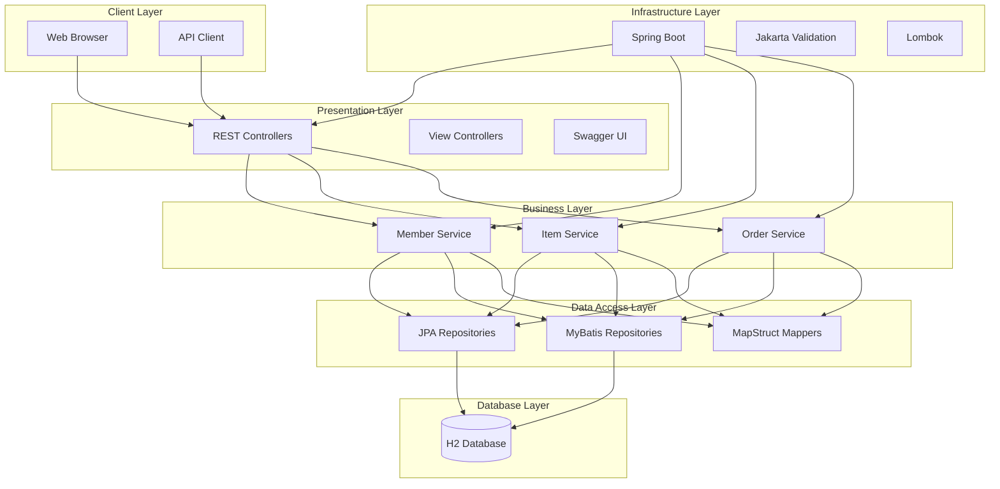
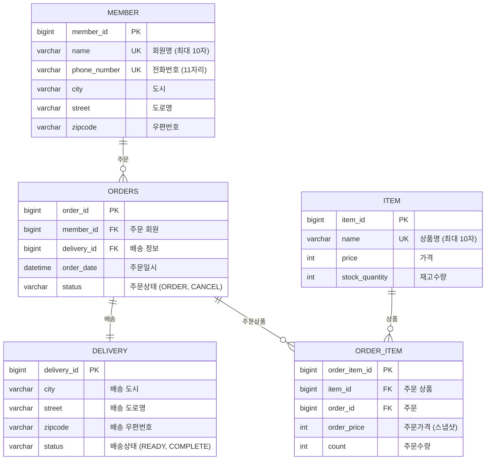

``` mermaid
classDiagram
    %% Entity Layer
    class Member {
        -Long id
        -String name
        -String phoneNumber
        -Address address
        +Member(name, phoneNumber, address)
    }
    
    class Item {
        -Long id
        -String name
        -int price
        -int stockQuantity
        +Item(name, price, stockQuantity)
        +addStock(quantity)
        +removeStock(quantity)
        +updateByRequest(request)
    }
    
    class Order {
        -Long id
        -Member member
        -List~OrderItem~ orderItems
        -Delivery delivery
        -LocalDateTime orderDate
        -OrderStatus status
        +assignMember(member)
        +addOrderItem(orderItem)
        +assignDelivery(delivery)
        +changeStatus(status)
        +createOrder(member, delivery, orderItems)
    }
    
    class OrderItem {
        -Long id
        -Item item
        -Order order
        -int orderPrice
        -int count
        +createOrderItem(item, orderPrice, count)
        +assignItem(item)
        +assignOrder(order)
        +assignOrderPrice(orderPrice)
        +assignCount(count)
    }
    
    class Delivery {
        -Long id
        -Address address
        -DeliveryStatus status
        +Delivery(address, deliveryStatus)
    }
    
    class Address {
        -String city
        -String street
        -String zipcode
        +Address(city, street, zipcode)
    }
    
    %% Enum Classes
    class OrderStatus {
        <<enumeration>>
        ORDER
        CANCEL
    }
    
    class DeliveryStatus {
        <<enumeration>>
        READY
        COMPLETE
    }
    
    %% Service Layer
    class MemberService {
        -MemberJpaRepository memberJpaRepository
        -MemberMyBatisRepository memberMyBatisRepository
        -MemberMapper memberMapper
        +createMemberByJpa(request)
        +createMemberByMyBatis(request)
        +getMemberListByJpa()
        +getMemberListByMyBatis()
    }
    
    class ItemService {
        -ItemMapper itemMapper
        -ItemJpaRepository itemJpaRepository
        -ItemMyBatisRepository itemMyBatisRepository
        +createItemByJpa(request)
        +createItemByMyBatis(request)
        +getItemListByJpa()
        +getItemListByMyBatis()
        +updateItemByJpa(request, id)
        +updateItemByMyBaits(request, id)
    }
    
    class OrderService {
        -OrderMapper orderMapper
        -OrderJpaRepository orderJpaRepository
        -OrderMyBatisRepository orderMyBatisRepository
        -ItemService itemService
        -MemberService memberService
        +createOrderByJpa(request)
        +createOrderByMyBatis(request)
        +getOrderListByJpa()
        +getOrderListByMyBatis()
        +cancelOrderByMyBatis(orderId)
    }
    
    %% Controller Layer
    class MemberRestController {
        -MemberService memberService
        -MemberMapper memberMapper
        +createMember(request)
        +getMemberList()
    }
    
    class ItemRestController {
        -ItemService itemService
        -ItemMapper itemMapper
        +createItem(request)
        +getItemList()
        +updateItem(itemId, request)
    }
    
    class OrderRestController {
        -OrderService orderService
        +createOrder(request)
        +getOrderList()
        +deleteOrder(orderId)
    }
    
    %% Repository Layer
    class MemberJpaRepository {
        <<interface>>
        +save(entity)
        +findAll()
        +existsByName(name)
    }
    
    class ItemJpaRepository {
        <<interface>>
        +save(entity)
        +findAll()
        +existsByName(name)
    }
    
    class OrderJpaRepository {
        <<interface>>
        +save(entity)
        +findAll()
    }
    
    class MemberMyBatisRepository {
        <<interface>>
        +createMember(create)
        +selectMemberById(id)
        +isExistMember(name)
    }
    
    class ItemMyBatisRepository {
        <<interface>>
        +createItem(create)
        +selectItemById(id)
        +isExistItem(name)
    }
    
    class OrderMyBatisRepository {
        <<interface>>
        +createOrder(create)
        +selectOrderList()
        +cancelOrder(orderId)
    }
    
    %% Mapper Layer
    class MemberMapper {
        <<interface>>
        +memberRequestDtoToMember(request)
        +memberRequestDtoToMemberCreate(request)
        +memberToMemberResponseDto(member)
        +memberQueryResponseToMemberResponse(response)
    }
    
    class ItemMapper {
        <<interface>>
        +itemRequestDtoToItem(request)
        +itemRequestDtoToItemCreate(request)
        +itemToItemResponseDto(item)
        +itemQueryResponseToItemResponse(response)
    }
    
    class OrderMapper {
        <<interface>>
        +orderRequestDtoToOrder(request)
        +orderRequestDtoToOrderCreate(request)
        +orderToOrderResponseDto(order)
        +orderQueryResponseToOrderResponse(response)
    }
    
    %% DTO Classes
    class MemberRequestDto {
        +String name
        +String phoneNumber
        +Address address
    }
    
    class MemberResponseDto {
        +Long memberId
        +String name
        +String phoneNumber
        +Address address
    }
    
    class ItemRequestDto {
        +String name
        +int price
        +int stockQuantity
    }
    
    class ItemResponseDto {
        +Long itemId
        +String name
        +int price
        +int stockQuantity
    }
    
    class OrderRequestDto {
        +Long memberId
        +List~OrderItemRequest~ orderItems
        +DeliveryRequest delivery
    }
    
    class OrderResponseDto {
        +Long orderId
        +Long memberId
        +LocalDateTime orderDate
        +OrderStatus status
        +List~OrderItemResponse~ orderItems
        +DeliveryResponse delivery
    }
    
    %% Relationships (use multiplicities with quotes, not braces)
    Member "1" -- "many" Order : 주문
    Order "1" -- "1" Delivery : 배송
    Order "1" -- "many" OrderItem : 주문상품
    Item "1" -- "many" OrderItem : 상품
    Member "1" -- "1" Address : 주소
    Delivery "1" -- "1" Address : 배송주소
    
    %% Service Dependencies
    MemberService --> MemberJpaRepository
    MemberService --> MemberMyBatisRepository
    MemberService --> MemberMapper
    
    ItemService --> ItemJpaRepository
    ItemService --> ItemMyBatisRepository
    ItemService --> ItemMapper
    
    OrderService --> OrderJpaRepository
    OrderService --> OrderMyBatisRepository
    OrderService --> OrderMapper
    OrderService --> ItemService
    OrderService --> MemberService
    
    %% Controller Dependencies
    MemberRestController --> MemberService
    ItemRestController --> ItemService
    OrderRestController --> OrderService
    
    %% Mapper Dependencies
    MemberMapper --> MemberRequestDto
    MemberMapper --> MemberResponseDto
    ItemMapper --> ItemRequestDto
    ItemMapper --> ItemResponseDto
    OrderMapper --> OrderRequestDto
    OrderMapper --> OrderResponseDto
```

# 📊 LLM 부하 테스트 플랫폼 - 자원 및 소요 기간 상세 계획 (1년 기준)

---

## ✅ 1. 비용 자원 (인건비 제외)

| 항목 | 필요 자원 및 내용 | 비고 |
|------|------------------|------|
| **서버/DB 인프라** | - AWS EC2 또는 Render - RDS - 월 10~30만 원 수준 | 초기 MVP는 프리티어로 커버 가능 |
| **GPT API 사용료** | - OpenAI, Claude API 테스트 - 월 $50~100 수준 (단일 모델) | 모델 수 늘어날수록 증가 |
| **도메인/SSL 인증** | - 도메인 연 2만 원 - SSL 무료(Let's Encrypt) 또는 유료(기업용) | SaaS 제품 필수 |
| **기타 운영 도구** | - PDF 리포트 도구 - CI/CD, 모니터링 등 SaaS 연동 | 선택적 과금 예상 |
| **총비용 추정** | 약 **300~500만 원/연** | 인건비 제외 기준 |

---

## ✅ 2. 기술 자원 (Java 백엔드 중심)

| 항목 | 기술 스택 | 비고 |
|------|------------|------|
| **백엔드** | - Java 17+, Spring Boot 3 - WebClient / OkHttp - Spring Security (JWT 인증) | API 서버 및 LLM 연동 |
| **프론트엔드** | - React - Chart.js, Recharts 등 시각화 | 결과 대시보드 및 입력 화면 |
| **데이터베이스** | - RDBMS 또는 NoSQL - Redis (선택) | 응답 캐싱, 중복 방지 |
| **부하 테스트 엔진** | - Apache JMeter (CLI 기반) - Gatling (Java 기반 DSL) - 직접 구현 시 Executor 기반 비동기 처리 | 스트리밍 응답까지 커버 가능 |
| **기타 기능** | - 응답 토큰 수 분석 - API별 요금 정책 계산 - Slack Webhook 연동 - Stripe 또는 PG사 결제 연동 | 유료화 및 협업 자동화 기반 |

---

## ✅ 3. 팀원 자원 (개발자 중심)

| 역할 | 인원 | 업무 |
|------|------|------|
| **백엔드 개발자** | 3~4명 | LLM 연동, 테스트 실행기, 요금 계산, 오류 대응 등 |
| **프론트엔드 개발자** | 1명 | 시나리오 입력 UI, 결과 리포트, 대시보드 구현 |

> 🧑‍💻 총 4~5명 개발 인력 중심 팀 구성을 기준으로 하며, PM/디자이너는 제외

---

## ✅ 4. 전체 일정 (1년 기준)

| 단계 | 기간 | 주요 내용 |
|------|--------|-----------|
| **1단계: 조사 및 기획** | 1~2월 (2개월) | 유사 서비스 분석, 고객 인터뷰, 요구사항 정의 |
| **2단계: 설계 및 구조 정의** | 3~4월 (2개월) | 기능 리스트, API 명세, ERD, 화면 설계 |
| **3단계: MVP 개발** | 5~7월 (3개월) | 부하 테스트 실행기, 응답 수집, 요금 계산, 리포트 PDF |
| **4단계: 베타 테스트** | 8월 (1개월) | 고객 테스트, 피드백 수렴, 개선안 정리 |
| **5단계: 기능 고도화 및 유료화** | 9~10월 (2개월) | 자연어 시나리오 생성, 멀티 벤더 비교, 요금제 구성 |
| **6단계: 정식 출시 준비** | 11월 (1개월) | 서버 안정화, 배포 자동화, 결제 시스템 연동 |
| **7단계: 출시 및 운영 대응** | 12월 (1개월) | 모니터링, 오류 핫픽스, 고객 지원 대응 |

---

## 🧾 요약

- **팀 규모**: 개발자 4~5명
- **기술 스택**: Java(Spring Boot), PostgreSQL, JMeter, React 등
- **예산 규모**: 약 300~500만 원 (인건비 제외)
- **전체 소요 기간**: 총 12개월
- **MVP 목표**: 7월 완료
- **정식 출시 목표**: 11~12월

---

